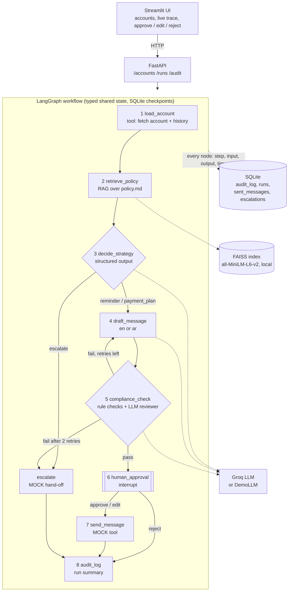

# Collections Copilot

A small demo AI agent for a debt-collection team. For one overdue account it
retrieves the relevant policy, picks a strategy, drafts a message in the
customer's language, checks it for compliance, and waits for a human to approve
before a **mock** send. Every step is written to an audit log.

> **Demo only.** All accounts and the policy are synthetic. Nothing is ever sent:
> "send" writes a row to a local SQLite file. Not legal or compliance advice.

## Quick start

**Docker (Python 3.11 image, everything included):**

```bash
cp .env.example .env        # DEMO_MODE=true works with no API key
docker compose up --build
```

**Without Docker (Python 3.11+):**

```bash
python -m venv .venv
.venv/Scripts/activate      # macOS/Linux: source .venv/bin/activate
pip install -r requirements.txt
cp .env.example .env
python run.py               # add --demo to force demo mode
```

Then open the UI at <http://localhost:8501> (API docs: <http://localhost:8000/docs>).

### Live mode (Groq)

Put your key in `.env` and turn demo mode off:

```
GROQ_API_KEY=...
DEMO_MODE=false
```

`.env` is git-ignored and is loaded with python-dotenv. The key is never
printed, logged or stored anywhere else. The model is set in
[copilot/config.py](copilot/config.py) (`openai/gpt-oss-120b` on Groq, which
supports tool calling and structured output).

### Demo mode

`DEMO_MODE=true` replaces only the LLM calls with pre-written outputs for three
accounts, so it needs no key and no internet. Retrieval, rule checks, the retry
loop, approval, the mock send and the audit log all run for real.

| Account | What it shows |
|---------|---------------|
| ACC-001 | Reminder in English, passes compliance first time |
| ACC-002 | Payment plan in Arabic; the first draft offers 25% against a 10% cap, is caught and redrafted |
| ACC-003 | Three broken promises and 204 days overdue: escalated, no message drafted |

### Tests

```bash
pytest
```

Seven tests, no API key or network needed. They cover the data and retrieval,
a draft that breaks the discount cap being caught and redrafted, escalation
after two failed retries, the approval gate and audit trail, the API end to end
in demo mode, the missing-key error state, and 429 backoff.

## Architecture



| Path | Purpose |
|------|---------|
| `data/accounts.json`, `data/policy.md` | 15 synthetic accounts and the SAMPLE policy |
| `copilot/config.py` | Model name, provider, rate-limit settings, paths |
| `copilot/policy.py` | Parses policy.md into RAG chunks and enforceable limits |
| `copilot/rag.py` | MiniLM + FAISS retrieval, keyword fallback when offline |
| `copilot/compliance.py` | Deterministic rules: discount cap, installment cap, banned phrases, language, length |
| `copilot/llm.py` | Provider factory, call spacing, backoff, the three LLM tasks |
| `copilot/demo.py` | Pre-written outputs for demo mode |
| `copilot/graph.py` | The LangGraph workflow and per-node audit wrapper |
| `copilot/service.py`, `copilot/api.py` | Run lifecycle and HTTP endpoints |
| `ui/app.py` | Streamlit UI |

### Design choices

- **The policy file is the single source of truth.** Discount caps, installment
  caps and banned phrases enforced in code are parsed from `policy.md`, the same
  file the LLM reads through RAG.
- **The LLM proposes, rules decide.** A separate LLM call reviews tone, but a
  draft only passes if the deterministic checks also pass. Escalation triggers
  that can be read off the record (3+ broken promises, 180+ days, amount above
  AED 50,000) override the model's strategy.
- **A human edit is checked too.** An edited message that breaks a hard rule is
  refused and the run stays paused.
- **Free-tier protection.** At least 2 s between LLM calls, 30 s timeout,
  exponential backoff (2, 4, 8, 16 s, honouring `Retry-After`) on 429 and
  transient errors, then a clear error in the UI.

### API

| Method | Path | Description |
|--------|------|-------------|
| GET | `/accounts` | The 15 synthetic accounts |
| POST | `/runs/{account_id}` | Start the agent (returns at once; the run continues in the background) |
| GET | `/runs/{id}` | Status, state, pending approval and step trace |
| POST | `/runs/{id}/decision` | `{"action": "approve" \| "edit" \| "reject", "message": "..."}` |
| GET | `/audit/{id}` | Audit records for a run |
| GET | `/runs`, `/health` | Recent runs; mode and model |

### Swapping the LLM provider

Set `LLM_PROVIDER` and `LLM_MODEL` (or edit `copilot/config.py`), install the
provider package and add its credentials to `.env`. `build_chat_model()` in
`copilot/llm.py` has branches for `groq`, `anthropic` (`langchain-anthropic`)
and `azure_openai` (`langchain-openai`). Only the Groq branch has been run.
`llm_extra_kwargs` in the config holds Groq-specific options and should be
cleared for other providers.

## Deploying

A public deployment should always set `APP_PASSWORD`, which puts a shared-password
screen in front of the UI so strangers cannot spend the Groq quota. Secrets go in
the host's secrets page, never in the repository. Storage on free hosts is
ephemeral: runs and the audit log reset when the app restarts.

### Streamlit Community Cloud (free, deploys from GitHub)

Community Cloud runs a single Streamlit process, so `EMBEDDED_API=true` makes the
UI start the FastAPI service in a background thread of the same process.

1. At <https://share.streamlit.io> choose **Create app**, pick this repository,
   branch `main`, main file `ui/app.py`, and Python 3.11 under advanced settings.
2. Paste into **Secrets**:

   ```toml
   GROQ_API_KEY = "your-groq-api-key"
   APP_PASSWORD = "choose-a-password"
   DEMO_MODE = "false"
   EMBEDDED_API = "true"
   ```

If the app runs out of memory loading the embedding model, add
`RAG_BACKEND = "keyword"` to use the lightweight retriever.

### Hugging Face Spaces (Docker)

The block at the top of this README configures a Docker Space serving the UI on
port 8501. Push the repository to the Space and add secrets `GROQ_API_KEY` and
`APP_PASSWORD` plus variable `DEMO_MODE=false` under **Settings > Variables and
secrets**.

## Limitations and next steps

**Limitations**

- Rule checks are regex-based. Any percentage in a message is treated as a
  discount, installment counts are detected only in common English and Arabic
  phrasings, and banned-phrase matching does not handle Arabic prefixes or
  paraphrases. The LLM reviewer is a second opinion, not a guarantee.
- Contact-hour and contact-frequency limits (policy section 3) are in the policy
  and visible to the LLM, but are not enforced in code because nothing is
  actually sent or scheduled.
- The policy is eight short sections, so retrieval returns most of it. This
  shows the RAG plumbing, not retrieval quality at scale.
- Demo mode covers three accounts with fixed outputs.
- No authentication, no user identity on approvals, and runs execute in threads
  inside a single API process. SQLite is the only store.
- Token counts come from the provider's usage metadata and are zero in demo mode.
- Arabic output quality depends on the model and has not been reviewed by a
  native speaker.

**Next steps**

- Real channel adapters (SMS, email) behind the same tool interface, with
  contact-hour and frequency enforcement at send time.
- Record who approved each message; add authentication and roles.
- An evaluation set of drafts with known violations to measure the compliance
  check's catch rate and false positives.
- Move rules to a structured policy format with versioning; store the policy
  version on each audit record.
- Postgres and a job queue for concurrent runs; tracing with LangSmith or
  OpenTelemetry.

## Troubleshooting

- **Windows with Smart App Control / application control:** unsigned native
  libraries (torch, faiss, some `uuid_utils` builds) may be blocked. Use Docker,
  or expect the retriever to fall back to keyword search (shown in the UI as
  `retriever: keyword`). If `langchain_core` fails to import with a DLL error,
  `pip install "uuid_utils==0.16.2"` worked on the development machine.
- **First live start is slow:** the embedding model (about 90 MB) is downloaded
  once. The Docker image has it baked in.
